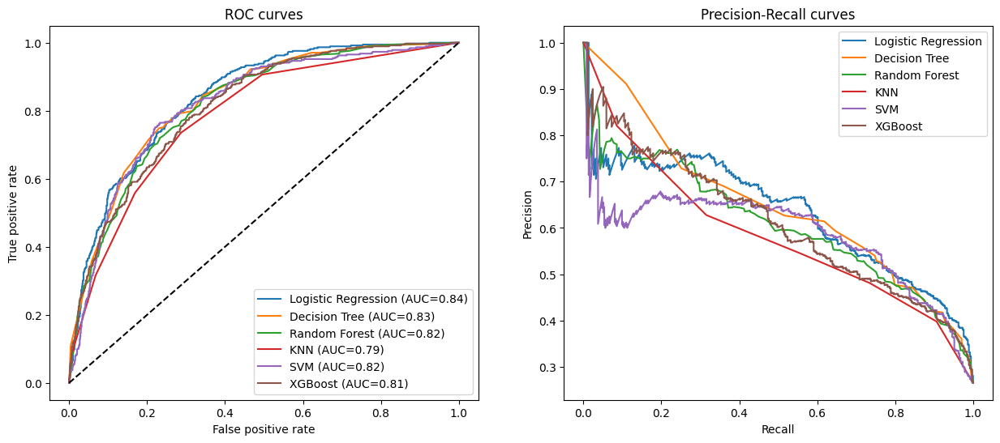
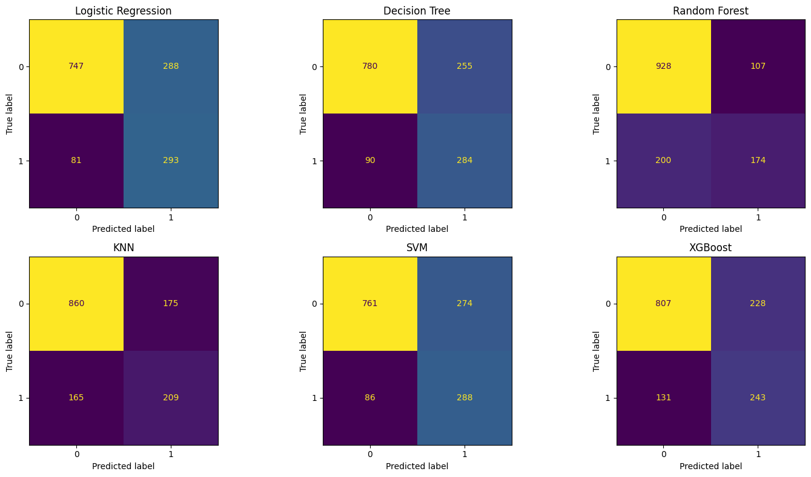
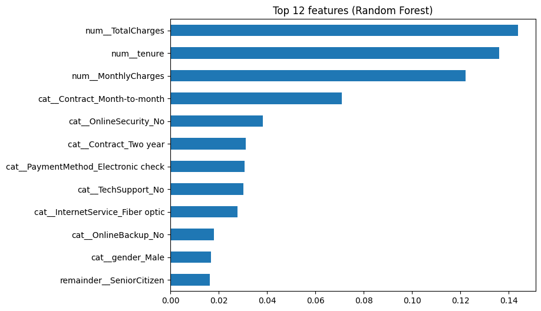

# Customer Churn Prediction & Comparative Machine Learning Dashboard

**Live app:** [https://your-app-name.streamlit.app](https://your-app-name.streamlit.app)

An end-to-end data science project that predicts whether a telecom customer will leave (churn) or stay, compares eight machine learning models, and serves the best one through an interactive Streamlit dashboard.

## Business Problem

Winning a new customer costs far more than keeping an existing one. Every customer who leaves means lost monthly revenue and lost marketing spend. If a company can identify high-risk customers early, its retention team can step in with targeted offers, better plans or contract renegotiations before they go.

This project builds a classifier that flags likely churners, and compares several algorithms to decide which one best fits that business goal. Because missing a churner is more costly than contacting a customer who would have stayed, the evaluation focuses on **recall, F1 and ROC-AUC** rather than accuracy alone.

## Dataset

**Telco Customer Churn** (IBM sample data, available on [Kaggle](https://www.kaggle.com/datasets/blastchar/telco-customer-churn)).

- 7,043 customers, 21 columns (19 features after removing `customerID`, plus the `Churn` target)
- Numeric features: `tenure`, `MonthlyCharges`, `TotalCharges`, `SeniorCitizen` (binary)
- Categorical features: demographics, phone and internet services, `Contract`, `PaperlessBilling`, `PaymentMethod`
- `TotalCharges` is stored as text and contains 11 blank values (customers with tenure 0). These are converted to numbers and imputed inside the model pipeline
- Target is imbalanced: about 26.5% of customers churned

## Technologies

Python 3.12, pandas, NumPy, scikit-learn, XGBoost, Matplotlib, Seaborn, Plotly, Streamlit, joblib, Git/GitHub.

## Approach

1. **EDA:** univariate, bivariate and correlation analysis in a single notebook.
2. **Preprocessing:** stratified 80/20 train-test split first, then a `ColumnTransformer` fitted on the training data only (median imputation and standard scaling for numeric columns, one-hot encoding for categorical columns). Keeping all of it inside a scikit-learn `Pipeline` avoids data leakage.
3. **Class imbalance:** handled with class weighting (`class_weight="balanced"`, `scale_pos_weight` for XGBoost) instead of resampling.
4. **Models:** Logistic Regression, Decision Tree, Random Forest, KNN, SVM and XGBoost.
5. **Tuning:** `RandomizedSearchCV` (10 iterations, 3-fold CV, scored on F1) for Random Forest and XGBoost.
6. **Evaluation:** Accuracy, Precision, Recall, F1, ROC-AUC, confusion matrices, ROC and precision-recall curves, feature importance.
7. **Deployment:** the champion pipeline (preprocessing plus model) is saved with joblib and served through Streamlit.

## Key EDA Findings

- **Contract type is the strongest signal.** Month-to-month customers churn at about 43%, compared with about 11% for one-year and 3% for two-year contracts.
- **Payment method matters.** Electronic check users churn at about 45%, versus roughly 15-19% for mailed check, bank transfer and credit card customers.
- **Fiber optic customers churn more.** About 42% for fiber optic, 19% for DSL and 7% for customers with no internet service.
- **Senior citizens churn more.** About 42%, compared with about 24% for other customers.
- **New customers are the most at risk.** `tenure` has the strongest negative correlation with churn (-0.35), and it is strongly correlated with `TotalCharges` (0.83), so the two carry overlapping information.

## Model Comparison

All models were evaluated on the same held-out test set (20% of the data). Tuned models are marked.

| Model | Accuracy | Precision | Recall | F1 | ROC-AUC |
|---|---|---|---|---|---|
| Random Forest (tuned) | 0.757 | 0.529 | 0.783 | 0.631 | 0.843 |
| **XGBoost (tuned)** 🏆 | 0.752 | 0.522 | **0.799** | 0.631 | **0.847** |
| Decision Tree | 0.755 | 0.527 | 0.759 | 0.622 | 0.832 |
| SVM | 0.744 | 0.512 | 0.770 | 0.615 | 0.821 |
| Logistic Regression | 0.738 | 0.504 | 0.783 | 0.614 | 0.842 |
| XGBoost | 0.745 | 0.516 | 0.650 | 0.575 | 0.814 |
| KNN | 0.759 | 0.544 | 0.559 | 0.551 | 0.785 |
| Random Forest | 0.782 | 0.619 | 0.465 | 0.531 | 0.820 |

**Champion model: XGBoost (tuned).** It ties tuned Random Forest for the best F1 (0.631) and has the highest recall (0.799) and ROC-AUC (0.847). For churn, catching customers who are about to leave matters more than raw accuracy: the untuned Random Forest has the best accuracy (0.782) but misses more than half of churners (recall 0.465). The differences between the top models are small on a single test split, so the choice rests on the business priority of catching churners. Precision is around 52%, meaning about half of flagged customers would not actually have left, which is an acceptable cost for low-cost retention offers.

Hyperparameter tuning made a large difference: Random Forest improved from F1 0.531 to 0.631 and XGBoost from 0.575 to 0.631.

### Charts







## Dashboard

The Streamlit app has six sections, selected from the sidebar:

- **Home:** project goal, business context and headline numbers
- **Dataset Explorer:** searchable table, `describe()` statistics, column profile and missing-value counts
- **EDA Dashboard:** interactive Plotly charts with dropdown selectors and a correlation heatmap
- **Model Training:** pick any of the six models, train it, and see its metrics and confusion matrix
- **Model Comparison:** leaderboard, metric charts and the highlighted champion model
- **Prediction System:** enter a customer's details and get a prediction (**Churn Risk** or **Retained Account**) with a confidence score

## Project Structure

```
Churn_Project/
├── data/
│   └── Telco-Customer-Churn.csv
├── notebooks/
│   └── churn_analysis.ipynb      # EDA, preprocessing, models, tuning, saving
├── models/
│   ├── churn_pipeline.joblib     # champion pipeline (preprocessing + XGBoost)
│   └── results.csv               # model leaderboard
├── visuals/                      # charts and screenshots
├── app.py                        # Streamlit app
├── utils.py                      # data loading, model training helpers
├── requirements.txt
└── README.md
```

## Run Locally

Python 3.12 is recommended. The saved model was created with the exact library versions pinned in `requirements.txt`, and newer XGBoost releases require Python 3.12 or later.

```bash
git clone https://github.com/YousufKhaskheli/Churn_Project.git
cd Churn_Project

python -m venv venv
venv\Scripts\activate          # Windows
# source venv/bin/activate     # macOS / Linux

pip install -r requirements.txt
streamlit run app.py
```

The app opens at `http://localhost:8501`.

To reproduce the analysis, open `notebooks/churn_analysis.ipynb` and run all cells. This also regenerates the model file and the charts.

## Deployment

The app is deployed on Streamlit Community Cloud from the `main` branch, with `app.py` as the entry point and Python 3.12 selected in the advanced settings.

## Limitations

- `TotalCharges` in the prediction form is estimated as tenure × monthly charges.
- The models were trained with class weighting, so the predicted probability is best read as a risk score rather than an exact frequency.
- Results come from a single train-test split, so small differences between the top models are within noise.

## Author

Yousuf ([@YousufKhaskheli](https://github.com/YousufKhaskheli))
